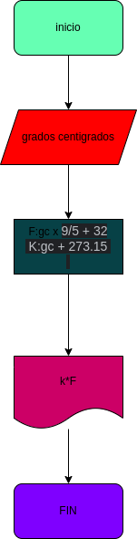

# ejercicio no.2

## pasar grados centigrados a farenheit y kelvin

# analisis
variable de entrada

gr:grados centigrados

variable de proceso y  salida ( processing, stoge, output)

k: grados kelvin
f: grados farenheit
# DISEÑO

# CONSTRUCCION